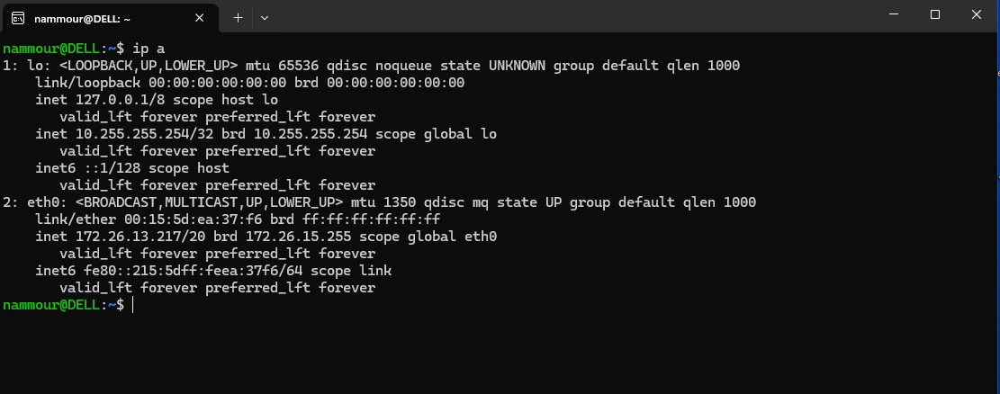
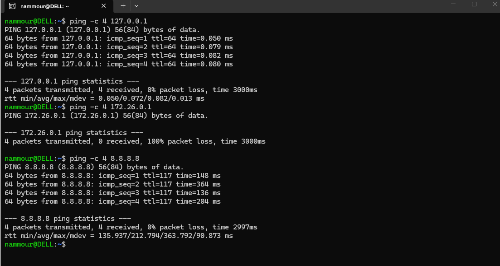
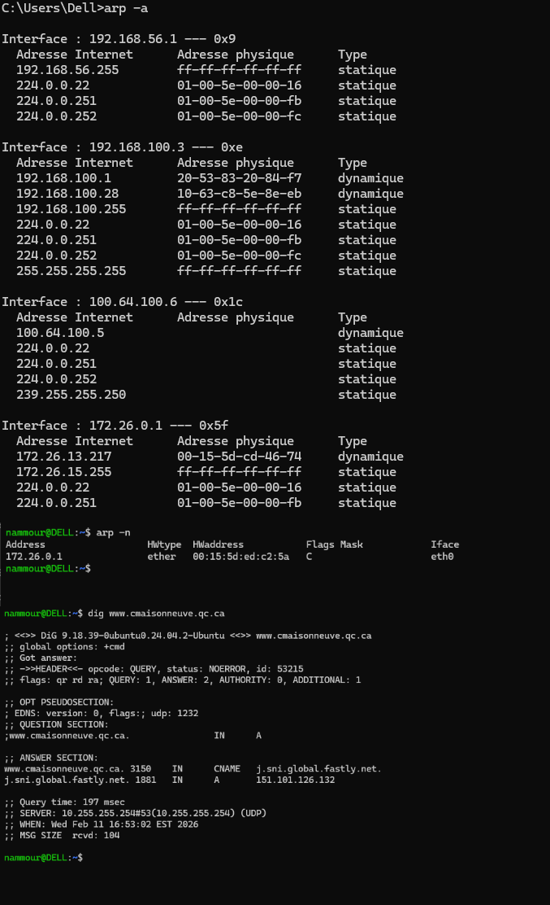
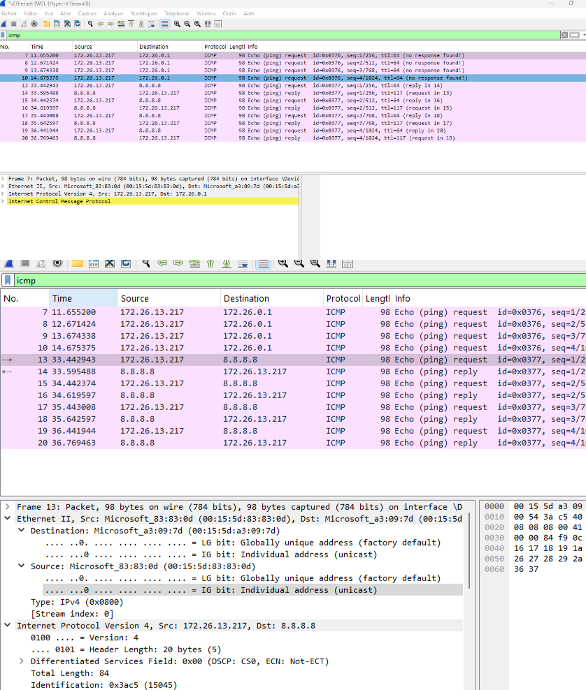
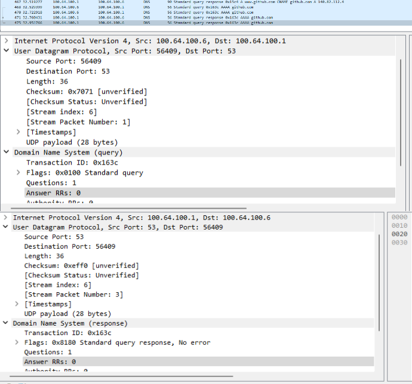
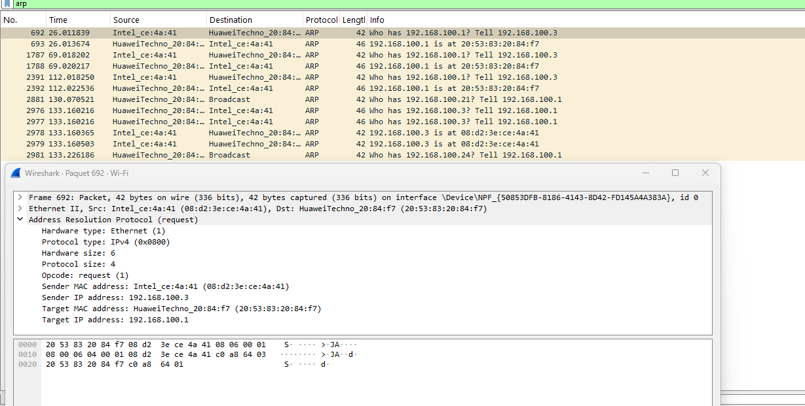

# Laboratoire 2 - Introduction aux Réseaux
## Systèmes d'exploitation - Collège de Maisonneuve

---

**Nom :** AMMOUR    

**Prénom :** Nadjib

**Groupe :** 

**Lien GitHub du devoir** : https://github.com/NjGuitlab/Labo_Reseaux.git

**Date de remise :** Jeudi 13 février 2026
---

## Barème récapitulatif

| Section | Points | Note |
|---------|--------|------|
| Partie 1 : Questions théoriques | 20 | /20 |
| Partie 2 : Commandes réseau | 25 | /25 |
| Partie 3 : Analyse Wireshark | 25 | /25 |
| Partie 4 : Script Bash | 30 | /30 |
| **TOTAL** | **100** | **/100** |

---

# Partie 1 : Questions théoriques (20 points)

## Question 1 - Modèle OSI (5 points)

### a) Complétez le tableau (2.5 pts)

| Protocole/Élément | N° Couche | Nom de la couche |
|-------------------|-----------|------------------|
| HTTP |7 | Application |
| Adresse IP | 3 | Réseau |
| Câble Ethernet | 2 | Liaison |
| TCP | 4 | Transport |
| Adresse MAC | 2 | Liaison |

### b) Différence entre le modèle OSI et TCP/IP (2.5 pts)

```
Votre réponse : Le modele OSI est un modele théorique composé de 7 couches, tandis que le modele TCP/IP est un modele plus pratique utilisé sur internet, composé de 4 couches qui regroupent certaines couches du modele OSI


```

---

## Question 2 - Adresses IP (5 points)

### a) Adresses privées ou publiques (2.5 pts)

| Adresse IP | Privée / Publique |
|------------|-------------------|
| 192.168.1.50 | Privé |
| 8.8.8.8 | Publique |
| 10.0.0.1 | Privé |
| 172.20.5.100 | Privé |
| 200.100.50.25 | Publique |

### b) Qu'est-ce qu'un masque de sous-réseau ? À quoi sert-il ? (2.5 pts)

```
Votre réponse :

Un masque de sous-réseau est un nombre qui permet de séparer la partie réseau la partie hote d'une adresse IP. Il sert à determiner si deux machines appartiennent au meme réseau et à organiser le découpage d'un réseau en sous réseaux.
```
---

## Question 3 - Protocoles (10 points)

### a) Expliquez le fonctionnement du protocole ARP. Pourquoi est-il nécessaire ? (3 pts)

```
Votre réponse :
Le protocole ARP permet de faire la correspondance entre une adresse IP et une adresse MAC sur un réseau local. Lorsqu'un appareil souhaite communiquer avec un autre, il envoie une requete ARP en diffusion afin d'obtenir l'adresse MAC associée à l'adresse IP cible. L'ARP est nécessaire car la communication au niveau de la couche liaison se fait avec des adresses MAC

```

### b) Différence entre une requête DNS de type A et de type AAAA ? (2 pts)

```
Votre réponse : La différence réside dans la version de protocole IP utilisée : l'enregistrement A lie un nom de domaine à une adresse IPv4(format 32 bits) , tandis que l'enregistrement AAAA le lie à une adresse IPv6(format 128bits)


```

### c) Expliquez ce que fait la commande `ping` au niveau du protocole ICMP. Quels types de messages sont échangés ? (3 pts)

```
Votre réponse :

La commande ping permet de vérifier la joignabilité d'une cible ("exemple : google.com) et d'estimer la qualité de la liaison. Techniquement, elle utilise le protocole ICMP pour effectuer un cycle d'échange simple:
L'emetteur envoie un paquet ICMP Echo request à l'adresse IP de destination et si celle ci est active et autorise le trafic, elle répond par un paquet ICMP echo reply. Ce mécanisme permet de calculer le temps ecoulé pour l'aller-retour tout en verifiant l'absence de perte de paquets et le nombre de sauts réseau.

```

### d) Sur quel port et avec quel protocole de transport fonctionne DNS par défaut ? Pourquoi ce choix ? (2 pts)

```
Votre réponse :

Le port utilisé par le DNS est le port 53 et son protocole de transport par défaut est l'UDP. Ce choix est dicté par une recherche d'efficacité et de rapidité : une requête DNS étant très légère, elle doit être résolue instantanément pour ne pas ralentir la navigation. Contrairement au TCP, l'UDP n'impose pas de handshake (poignée de main) pour établir une connexion, ce qui réduit considérablement le temps de latence et la charge sur les serveurs DNS qui reçoivent des millions de requêtes par seconde.

```

---

# Partie 2 : Commandes réseau (25 points)

## Exercice 1 : Configuration réseau (10 points)

### a) Configuration réseau

**Commande utilisée :**
```bash
ip a

```

**Adresse IP :**
```
172.26.13.217

```

**Masque de sous-réseau :**
```
/20 equivaut à : 255.255.240.0
```

**Nom de l'interface réseau principale :**
```
nome de l'interface réseau : eth0

```

### b) Passerelle par défaut

**Commande utilisée :**
```bash
 ip route | grep default | awk '{print $3}'
```

**Adresse de la passerelle :**
```
 172.26.0.1 
```

### c) Serveurs DNS

**Commande utilisée :**
```bash
cat /etc/resolv.conf
#plus précis : grep '^nameserver' /etc/resolv.conf
```

**Serveurs DNS configurés :**
```
nameserver 10.255.255.254
```

> 📸 **Capture d'écran 1** : Insérez votre capture montrant la configuration réseau
> 
>

---

## Exercice 2 : Tests de connectivité avec ping (8 points)

### a) Ping vers localhost (127.0.0.1) - 4 paquets

**Commande exacte utilisée :**
```bash
ping -c 4 127.0.0.1 
```

**Résultat (succès/échec) :**
```
Succes

```

**Temps moyen de réponse :**
```
0.072 ms

```

### b) Ping vers la passerelle - 4 paquets

**Résultat (succès/échec) :**
```
échec 

```

**Temps moyen de réponse :**
```
Non défini (Dans un environnement WSL )
```

### c) Ping vers 8.8.8.8 - 4 paquets

**Résultat (succès/échec) :**
```
succes 
```

**Temps moyen de réponse :**
```
212.794 ms
```

### d) Si le ping vers 8.8.8.8 fonctionne mais pas vers google.com, quel serait le problème probable ?

```
Votre réponse :

Le ping vers 8.8.8.8 fonctionne car il utilise directement une adresse IP et ne nécessite pas de résolution DNS.Le ping vers google.com échoue car la résolution de nom de domaine ne fonctionne pas. Le probleme se situe donc au niveau du DNS.

```

> 📸 **Capture d'écran 2** : Insérez votre capture des tests ping
> 
> >

---

## Exercice 3 : Table ARP et résolution DNS (7 points)

### a) Table ARP

**Commande utilisée :**
```bash
arp -n (ubuntu)
arp -a (cmd)
```

**Nombre d'entrées :**
```
ubuntu (1 seule entrée)
cmd (18 entrées)

```

**Une entrée (IP et MAC) :**
```
Ubutntu :
IP : 172.26.0.1
MAC: 00:15:5d:ed:c2:5a 

CMD :
IP : 192.168.100.1
MAC : 20-53-83-20-84-f7
```

### b) Requête DNS pour cmaisonneuve.qc.ca

**Commande utilisée :**
```bash
dig www.cmaisonneuve.qc.ca

#alternative(Pour afficher l'IP) : dig +short www.cmaisonneuve.qc.ca

```

**Adresse IP obtenue :**
```
151.101.126.132

```

### c) Commande `dig` pour github.com - TTL

**TTL (Time To Live) de l'enregistrement :**
```
TTL : 2706 secondes
```

> 📸 **Capture d'écran 3** : Insérez votre capture de la table ARP et d'une requête DNS
> 
> >

---

# Partie 3 : Analyse Wireshark (25 points)

## Exercice 4 : Capture et analyse ICMP (10 points)

### Analyse d'un paquet "Echo (ping) request"

| Information | Valeur observée |
|-------------|-----------------|
| Adresse MAC source | 00:15:5d:83:83:0d|
| Adresse MAC destination | 00:15:5d:a3:09:7d |
| Adresse IP source | 172.26.13.217 |
| Adresse IP destination | 8.8.8.8 |
| Type ICMP (numéro) | Echo ping(request) (8) |
| Code ICMP | 0 |

### Question : Différence entre le Type ICMP d'un "Echo Request" et d'un "Echo Reply" ?

```
Votre réponse :

La différence réside dans le champs Type de l'entete ICMP : Un Echo request utilise le Type 8 tandis que l'Echo Reply utilise le Type 0

```

> 📸 **Capture d'écran 4** : Capture Wireshark montrant les paquets ICMP avec le détail d'un paquet
> 
> 

---

## Exercice 5 : Capture et analyse DNS (8 points)

### Analyse de la requête et réponse DNS

| Information | Valeur observée |
|-------------|-----------------|
| Port source (requête) | 56409 |
| Port destination (requête) | |
| Protocole de transport | UDP |
| Type de requête DNS | AAAA |
| Adresse IP dans la réponse | Aucune |

> 📸 **Capture d'écran 5** : Capture Wireshark montrant la requête et réponse DNS
> 
> 

---

## Exercice 6 : Capture et analyse ARP (7 points)

### Tableau d'un échange ARP observé

| Information | ARP Request | ARP Reply |
|-------------|-------------|-----------|
| Adresse MAC source |08:d2:3e:ce:4a:41 | 20:53:83:20:84:f7|
| Adresse MAC destination | ff:ff:ff:ff:ff:ff | 08:d2:3e:ce:4a:41 |
| Adresse IP recherchée | 192.168.100.1| 192.168.100.3 |

### Question : Pourquoi l'adresse MAC de destination dans l'ARP Request est-elle `ff:ff:ff:ff:ff:ff` ?

```
Votre réponse :

Il s'agit d'une adresse de braodcast(diffusion), au moment de la requete l'ordinateur connait l'adresse IP cible mais ne connait pas l'adresse MAC physique donc il fait une interrogation générale à tous les appareils présent sur le réseau local, seul celui avec l'adresse IP correspondante va répondre en donnant son adresse MAC physique
```

> 📸 **Capture d'écran 6** : Capture Wireshark montrant l'échange ARP
> 
> 

---

# Partie 4 : Script de diagnostic réseau (30 points)

## Exercice 7 : Création du script

### Informations sur votre script

**Nom du fichier :** `diagnostic_reseau.sh`

### Checklist des fonctionnalités implémentées

Cochez les fonctionnalités que vous avez implémentées :

- [ ] Affichage du nom de l'hôte
- [ ] Affichage de la date et heure
- [ ] Affichage de la version du système
- [ ] Affichage de l'adresse IP locale
- [ ] Affichage de l'adresse de la passerelle
- [ ] Affichage des serveurs DNS
- [ ] Test de connectivité localhost
- [ ] Test de connectivité passerelle
- [ ] Test de connectivité Internet (8.8.8.8)
- [ ] Test de résolution DNS (google.com)
- [ ] Affichage de la table ARP
- [ ] Résolution DNS de 2+ domaines
- [ ] Gestion des erreurs (messages si échec)
- [ ] Commentaires dans le code
- [ ] Affichage clair avec titres de sections

### Difficultés rencontrées (optionnel)

```
Décrivez ici les difficultés que vous avez rencontrées lors de la création du script :


```

> 📸 **Capture d'écran 7** : Capture montrant l'exécution de votre script
> 
> 

---

# Récapitulatif de la remise

## Fichiers à inclure dans votre projet

Vérifiez que votre projet contient :

- [ ] `reponse.md` (ce fichier complété)
- [ ] `diagnostic_reseau.sh` (votre script)
- [ ] `captures/capture1_config_reseau.png`
- [ ] `captures/capture2_ping.png`
- [ ] `captures/capture3_arp_dns.png`
- [ ] `captures/capture4_wireshark_icmp.png`
- [ ] `captures/capture5_wireshark_dns.png`
- [ ] `captures/capture6_wireshark_arp.png`
- [ ] `captures/capture7_script_execution.png`

---


---

*Bon travail !*